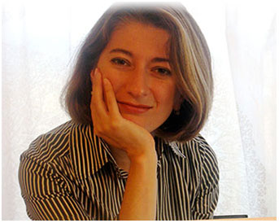

+++
title = 'Welcome'
date = 2023-01-01T08:00:00-07:00
draft = false
+++

     
    Paulina A. Kisselev, PhD   
    19105 36th Ave. W.   
    Building 2 Suite 213   
    Lynnwood, WA 98036   
    (425) 347-7275 Ext. 106  

If you are reading this, you are probably experiencing some discomfort in your life and wondering, “Can this person help me? Can I trust her? Am I the only one with this problem?” and dozens of other questions. I understand your worries and that is why I encourage you to call and find out whether working together would be a good fit.  

# Therapy

I am a licensed clinical psychologist and I help people who worry a lot and get anxious. I treat a variety of anxiety and mood disorders, including

*   generalized anxiety
*   panic disorder
*   social phobia
*   performance anxiety
*   agoraphobia
*   major depression

My approach to therapy is psychodynamic. In general, this means exploring aspects of self which may be hidden by paying close attention to your emotions, interpersonal relationships, and family history.

I treat people ages 16 through 65.

I work with most insurance companies. Please call for specific information.
